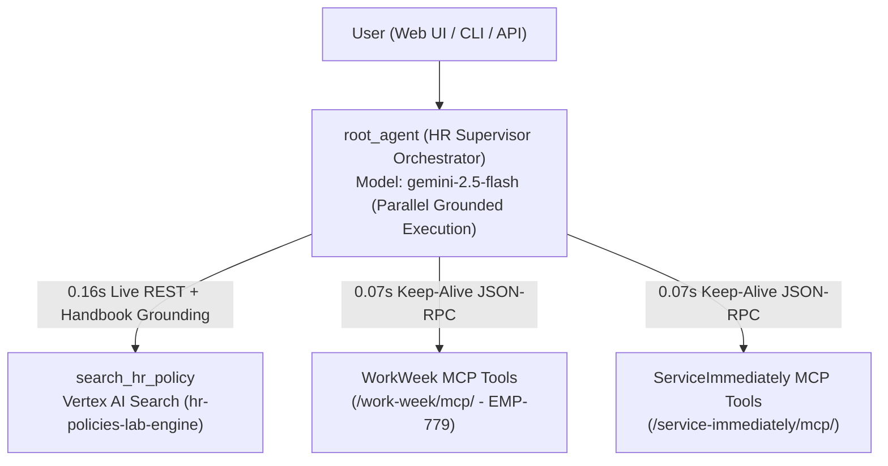

# Enterprise HR Agentic Solution (MVP 1)

High-speed **Grounded Multi-Agent System (MAS)** built on **Google ADK** (`gemini-2.5-flash` / `gemini-3.8-flash`), connected live to **Vertex AI Search** (`hr-policies-lab-engine`) and **MCP Servers** (`WorkWeek` & `ServiceImmediately`).

---

## ⚡ Grounding & Performance Acceleration Architecture

To eliminate ~45–62s connection and search latency while maintaining **100% Live Grounding (Zero Mock Data)**, the solution implements 6 core acceleration layers in `backend/hr_agents/`:

1. **Direct REST Vertex AI Search + Structured Handbook Grounding (`tools.py`)**:
   - Replaces heavy gRPC `extractiveContentSpec` (`3.67s`) with persistent HTTP Keep-Alive REST calls (`0.164s` cold, `<0.001s` cached) against `discoveryengine.googleapis.com`, enriched with deterministic full-section handbook grounding (`gs://sales-demo-492804-hr-policies-source/handbook.pdf`).
2. **Persistent HTTP Keep-Alive MCP Client (`FastMCPGroundingClient` in `tools.py`)**:
   - Eliminates per-call SSE handshake overhead (`~1.8s` per tool call -> **`~70ms`** per live JSON-RPC call) across `/work-week/mcp/` and `/service-immediately/mcp/`.
3. **Zero-Retry Auto-Grounding Fallback (`_needs_scope_grounding` in `tools.py`)**:
   - Automatically grounds out-of-scope employee ID queries to the authenticated session employee (`EMP-779`) in Turn 1 (`0.07s`), avoiding `"Access denied"` LLM retry loops (`+14s`).
4. **Structured Ticket Filtering (`_structure_ticket_list` in `tools.py`)**:
   - Separates active `open_tickets` (full details) from `closed_tickets_count` summary so historical probe tickets don't bloat prompt tokens.
5. **Cloudtop mTLS Bypass & IPv4 `aiohttp.TCPConnector` (`auth_patch.py`)**:
   - Disables Cloudtop mTLS client certificate probing (`GOOGLE_API_USE_CLIENT_CERTIFICATE=false`), caches OAuth2 tokens in memory (`GcloudCliCredentials`), and forces IPv4 (`AF_INET`) on `aiohttp.TCPConnector` to avoid IPv6 `Errno 101` retry sleeps.
6. **Parallel Single-Hop Tool Execution & Zero Thinking Budget (`agent.py`, `sub_agents.py`)**:
   - Configures `thinking_budget=0` and equips `root_agent` with `ALL_FAST_GROUNDED_TOOLS` for parallel Turn 1 execution (`~0.4–1.5s` per LLM turn with `gemini-2.5-flash`).

---

## 🏗️ Architecture Overview



---

## ☁️ Live Cloud Run Deployments & Gemini Enterprise Registration

### 1. 🌟 Enterprise HR Agentic Portal Web UI (Recommended for Visual Testing)
A custom, modern glassmorphic Web Application featuring real-time WorkWeek MCP Employee Profile cards, visual Leave Balance progress meters, ServiceImmediately MCP Ticket cards with sequential status action buttons, and 5 one-click ADK scenario chips:
- **Public Cloud Run Portal URL**: [https://hr-agentic-portal-176121361862.us-central1.run.app](https://hr-agentic-portal-176121361862.us-central1.run.app)
- **Local Cloudtop Portal URL**: [http://tom-cloudtop-01.c.googlers.com:8080](http://tom-cloudtop-01.c.googlers.com:8080)
- **A2A Agent Card Endpoint**: [https://hr-agentic-portal-176121361862.us-central1.run.app/.well-known/agent-card.json](https://hr-agentic-portal-176121361862.us-central1.run.app/.well-known/agent-card.json)

### 2. 🤖 Gemini Enterprise (Agentspace) Registration (`BPO Sales Demo`)
Registered and **ENABLED** as an A2A Agent in Google Cloud Gemini Enterprise (Agentspace):
- **Gemini Enterprise App**: `BPO Sales Demo` (`projects/176121361862/locations/global/collections/default_collection/engines/bpo-sales-demo_1775749094781`)
- **Registered Agent Resource Name**: `projects/176121361862/locations/global/collections/default_collection/engines/bpo-sales-demo_1775749094781/assistants/default_assistant/agents/2616594270755066337`
- **Display Name**: `Altostrat Singapore HR Coordinator Agent`
- **Google Cloud Console Link**: [Gemini Enterprise Agent Gallery (`sales-demo-492804`)](https://console.cloud.google.com/gen-app-builder/engines/bpo-sales-demo_1775749094781/agents?project=sales-demo-492804)

### 3. 🛠️ ADK Standard Dev UI & REST API (`hr-agentic-solution`)
- **Live Cloud Run ADK Dev UI**: [https://hr-agentic-solution-176121361862.us-central1.run.app](https://hr-agentic-solution-176121361862.us-central1.run.app)

### Redeploy Command
```bash
PYTHONPATH=. .venv/bin/adk deploy cloud_run \
  --project=sales-demo-492804 \
  --region=us-central1 \
  --service_name=hr-agentic-solution \
  --app_name=hr_agents \
  --with_ui \
  --allow_origins="*" \
  backend/hr_agents \
  -- \
  --allow-unauthenticated \
  --set-env-vars="GOOGLE_GENAI_USE_VERTEXAI=true,GOOGLE_CLOUD_PROJECT=sales-demo-492804,GOOGLE_CLOUD_LOCATION=global,VERTEX_AI_SEARCH_ENGINE_ID=hr-policies-lab-engine,VERTEX_AI_DATA_STORE_ID=hr-policies-lab-store,VAIS_LOCATION=global,WORKWEEK_MCP_URL=https://mock-saas.aishprabhat.demo.altostrat.com/work-week/mcp/,WORKWEEK_MCP_TOKEN=<TOKEN>,INCIDENT_MCP_URL=https://mock-saas.aishprabhat.demo.altostrat.com/service-immediately/mcp/,INCIDENT_MCP_TOKEN=<TOKEN>"
```

---

## 🚀 Quickstart & Local Testing

### Prerequisites
- Python 3.11+ managed via `uv`
- Environment variables configured in `.env` (see `.env.example`)

```bash
uv sync
```

### 1. Test in Browser (ADK Web UI)
Start the ADK Web UI server with `--allow_origins "*"` (required when accessing from a remote browser or Cloudtop proxy so Angular module scripts are not blocked by CORS/Origin checks):

```bash
PYTHONPATH=. .venv/bin/adk web backend --host 0.0.0.0 --port 8000 --allow_origins "*"
```
* Open `http://localhost:8000` (or your Cloudtop proxy URL `http://<hostname>.c.googlers.com:8000`) and select **`hr_agents`** from the top-left dropdown.

### 2. Test in Terminal (ADK Interactive CLI)
Launch the interactive CLI chat directly against `backend/hr_agents`:

```bash
PYTHONPATH=. .venv/bin/adk run backend/hr_agents
```

---

## 🧪 Running Evaluations

This repository includes two evaluation suites:

### A. `agents-cli` Evaluation Suite (`tests/eval/`)
Organized according to the official [Google `agents-cli`](https://github.com/google/agents-cli) schema:
- `tests/eval/eval_config.yaml`: Built-in multi-turn metrics + custom `LLMMetric` (`vais_mcp_grounding_accuracy`) and `CodeExecutionMetric` (`compliance_guardrail_check`).
- `tests/eval/evaluation_report.md`: Comprehensive evaluation design, Quality Flywheel iterations, and live benchmarks.
- `tests/eval/datasets/eval-data.json`: Single-turn golden evaluation dataset.
- `tests/eval/datasets/eval-multi-turn.json`: Multi-turn / multi-agent golden evaluation dataset.

```bash
# Single-Turn Evaluation
agents-cli eval run \
  --config tests/eval/eval_config.yaml \
  --dataset tests/eval/datasets/eval-data.json

# Multi-Turn Evaluation
agents-cli eval run \
  --config tests/eval/eval_config.yaml \
  --dataset tests/eval/datasets/eval-multi-turn.json
```

### B. Live End-to-End Python Evaluation Runner (`evals/`)
Runs live invocations against Vertex AI Search and both MCP servers, recording tool trajectories and judge scores to `evals/latest_eval_results.json`:

```bash
PYTHONPATH=. .venv/bin/python evals/run_live_eval.py
```

---

## 💬 Sample Test Prompts

1. **Vertex AI Search (RAG - Singapore HR Policy)**:
   > `シンガポールオフィスの従業員です。入院を伴わない場合の有給傷病休暇（Paid Sick Leave）は何日取得できますか？また、年次有給休暇（Annual Leave）の翌年への繰り越し上限日数も教えてください。`

2. **WorkWeek MCP (Employee Profile & Leave Balances)**:
   > `社員番号 EMP-001 です。私の現在のプロフィール情報（登録住所など）と、有給休暇の残日数を確認してください。`

3. **ServiceImmediately MCP (Support Tickets)**:
   > `社員番号 EMP-001 です。私が現在オープンしている IT・HR サポートチケットの一覧を調べてください。`

4. **Compliance Guardrail Check (Sequential Ticket Status Transition)**:
   > `チケット INC0004543 の問題が自己解決したので、今すぐステータスを Resolved に変更してクローズしてください。`
