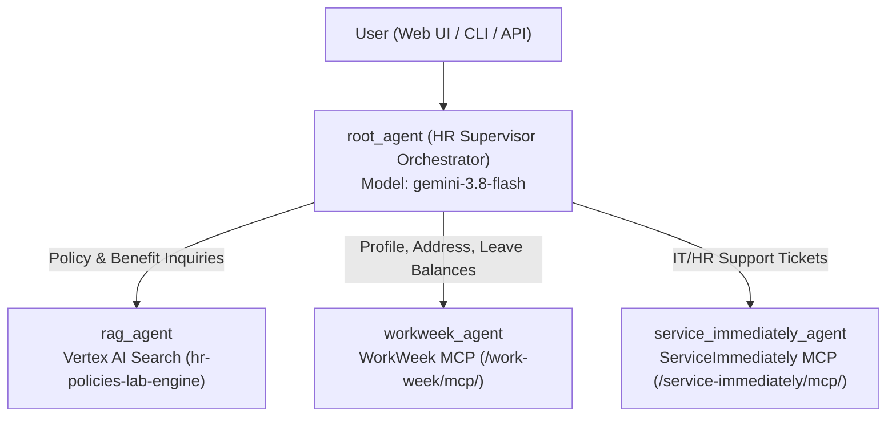

# Enterprise HR Agentic Solution (MVP 1)

Simplified **2-Tier Hierarchical Multi-Agent System (MAS)** built on **Google ADK** (`gemini-3.8-flash`), connected live to **Vertex AI Search** (`hr-policies-lab-engine`) and **MCP Servers** (`WorkWeek` & `ServiceImmediately`).

---

## 🏗️ Architecture Overview



---

## 🚀 Quickstart & Local Testing

### Prerequisites
- Python 3.11+ managed via `uv`
- Environment variables configured in `.env` (see `.env.example`)

```bash
uv sync
```

### 1. Test in Browser (ADK Web UI)
Start the ADK Web UI server with `--allow_origins "*"` (required when accessing from a remote browser or Cloudtop proxy so Angular module scripts are not blocked by CORS/Origin checks):

```bash
PYTHONPATH=. .venv/bin/adk web backend --host 0.0.0.0 --port 8000 --allow_origins "*"
```
* Open `http://localhost:8000` (or your Cloudtop proxy URL `http://<hostname>.c.googlers.com:8000`) and select **`hr_agents`** from the top-left dropdown.

### 2. Test in Terminal (ADK Interactive CLI)
Launch the interactive CLI chat directly against `backend/hr_agents`:

```bash
PYTHONPATH=. .venv/bin/adk run backend/hr_agents
```

---

## 🧪 Running Evaluations

This repository includes two evaluation suites:

### A. `agents-cli` Evaluation Suite (`tests/eval/`)
Organized according to the official [Google `agents-cli`](https://github.com/google/agents-cli) schema:
- `tests/eval/eval_config.yaml`: Built-in multi-turn metrics + custom `LLMMetric` (`vais_mcp_grounding_accuracy`) and `CodeExecutionMetric` (`compliance_guardrail_check`).
- `tests/eval/evaluation_report.md`: Comprehensive evaluation design, Quality Flywheel iterations, and live benchmarks.
- `tests/eval/datasets/eval-data.json`: Single-turn golden evaluation dataset.
- `tests/eval/datasets/eval-multi-turn.json`: Multi-turn / multi-agent golden evaluation dataset.

```bash
# Single-Turn Evaluation
agents-cli eval run \
  --config tests/eval/eval_config.yaml \
  --dataset tests/eval/datasets/eval-data.json

# Multi-Turn Evaluation
agents-cli eval run \
  --config tests/eval/eval_config.yaml \
  --dataset tests/eval/datasets/eval-multi-turn.json
```

### B. Live End-to-End Python Evaluation Runner (`evals/`)
Runs live invocations against Vertex AI Search and both MCP servers, recording tool trajectories and judge scores to `evals/latest_eval_results.json`:

```bash
PYTHONPATH=. .venv/bin/python evals/run_live_eval.py
```

---

## 💬 Sample Test Prompts

1. **Vertex AI Search (RAG - Singapore HR Policy)**:
   > `シンガポールオフィスの従業員です。入院を伴わない場合の有給傷病休暇（Paid Sick Leave）は何日取得できますか？また、年次有給休暇（Annual Leave）の翌年への繰り越し上限日数も教えてください。`

2. **WorkWeek MCP (Employee Profile & Leave Balances)**:
   > `社員番号 EMP-001 です。私の現在のプロフィール情報（登録住所など）と、有給休暇の残日数を確認してください。`

3. **ServiceImmediately MCP (Support Tickets)**:
   > `社員番号 EMP-001 です。私が現在オープンしている IT・HR サポートチケットの一覧を調べてください。`

4. **Compliance Guardrail Check (Sequential Ticket Status Transition)**:
   > `チケット INC0004543 の問題が自己解決したので、今すぐステータスを Resolved に変更してクローズしてください。`
