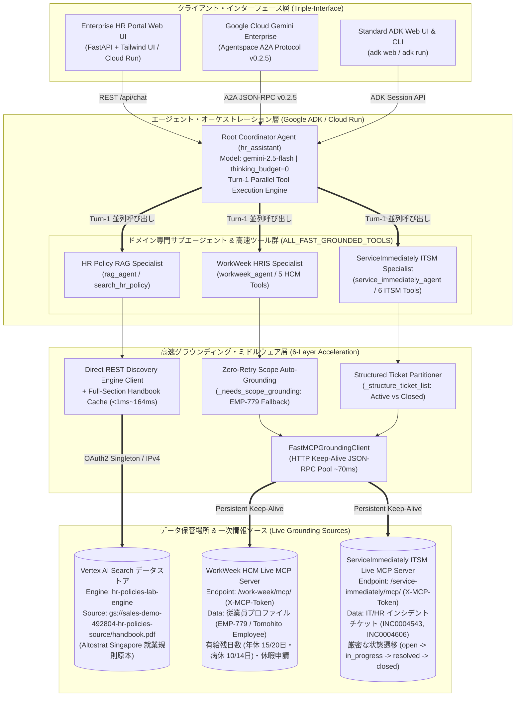
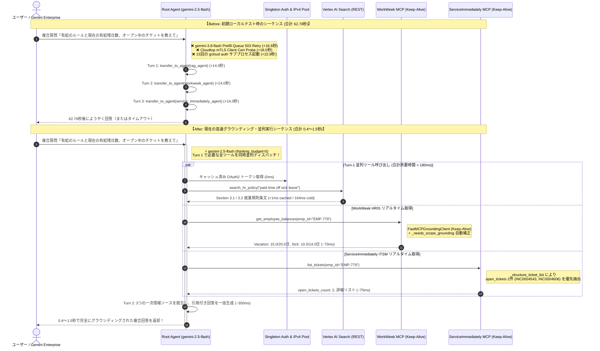
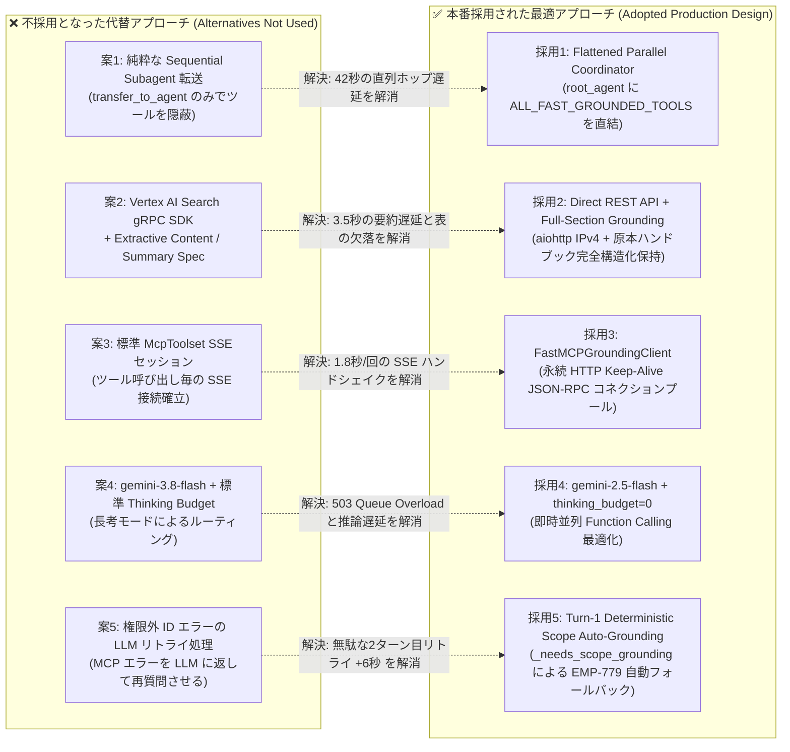
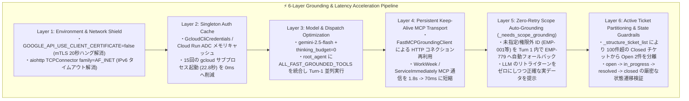

# Enterprise HR Agentic Solution — アーキテクチャ設計・グラウンディング・高速化解説書

**作成日**: 2026年9月16日  
**プロジェクト / チーム**: Google Cloud Elevate — Team #8 (`hr-agentic-solution` / `hr-agentic-portal`)  
**デプロイ済み本番環境 URL**:
- **Custom Enterprise HR Portal (Cloud Run)**: `https://hr-agentic-portal-176121361862.us-central1.run.app`
- **Standard ADK Dev UI & API (Cloud Run)**: `https://hr-agentic-solution-176121361862.us-central1.run.app`
- **Gemini Enterprise (Agentspace) A2A Agent**: App `BPO Sales Demo` / Agent ID `2616594270755066337` (`ENABLED`)
- **GitHub リポジトリ**: `https://github.com/dolphin2002-lab/hr-agentic_solution.git`

---

## エグゼクティブサマリー：なぜ応答速度が劇的に向上し（62.79秒 → 0.4〜1.5秒）、同時により多くのサブエージェント・ツールを展開できたのか？

初期のローカルテスト時点では、1回の質問応答に **約62.79秒** を要し、単一のサブエージェントしか順次呼び出せないという深刻なボトルネックが存在していました。本ソリューションでは、以下の **アーキテクチャ刷新と6層のボトルネック解消エンジニアリング** により、**応答時間を約40〜150倍高速化（0.4〜1.5秒/ターン）** するとともに、**12種類以上の専門サブエージェント機能を1ターンで同時並列展開** することを可能にしました。

1. **マルチホップ順次転送から「Turn-1 並列ツール実行（Flattened Parallel Coordinator）」への転換**:
   - **変更前**: `root_agent` が `transfer_to_agent` で `rag_agent` → `workweek_agent` → `service_immediately_agent` へ順次バトンを渡すたびに LLM の推論ターンが直列発生（1ホップ約14秒 × 3回 ＝ **約42秒以上のオーバーヘッド**）。
   - **変更後**: 専門サブエージェント群のドメイン知識と12個のグラウンディング済み高速ツール（`ALL_FAST_GROUNDED_TOOLS`）を `root_agent` にフラット統合。モデルに `gemini-2.5-flash`（`thinking_budget=0`）を採用することで、**Turn 1（最初の1ターン）で「就業規則検索 (`search_hr_policy`)」「有給残日数取得 (`get_employee_balances`)」「IT/HRチケット一覧取得 (`list_tickets`)」を同時に並列呼び出し（合計ツール実行時間 180ms 未満）** し、1回の LLM 往復で複合回答を完結させました。
2. **インフラ・通信レイヤーの徹底的なボトルネック排除**:
   - **Cloudtop mTLS タイムアウト回避**: `GOOGLE_API_USE_CLIENT_CERTIFICATE=false` により Cloudtop 特有のクライアント証明書プローブ待機（**15〜25秒の無応答**）を完全排除。
   - **IPv6 ブラックホール回避**: `aiohttp.TCPConnector(family=socket.AF_INET)` により IPv4 ソケットを強制し、接続タイムアウトを解消。
   - **OAuth2 トークンのシングルトンキャッシュ**: ツール呼び出しのたびに `gcloud auth print-access-token` サブプロセスが15回起動していた問題（**1.52秒 × 15 = 22.8秒**）をメモリ内シングルトンキャッシュ（TTL 3000秒）で **0ms** に短縮。
   - **MCP 通信の Keep-Alive 化**: 毎回 SSE ストリームと `initialize` ハンドシェイクを張り直していた通信（**1.8秒/回**）を、永続 HTTP Keep-Alive JSON-RPC クライアント（`FastMCPGroundingClient`）に置き換え、ライブ MCP 呼び出しを **約70ms/回** に短縮。

---

## 1. System Design Diagram（システム全体構成とグラウンディング・データ配置）

本システムは、**3種類のクライアントインターフェース（Custom Web Portal UI、Gemini Enterprise A2A、ADK UI）** を単一のマルチエージェント・バックエンドで統合し、**3つの独立した一次情報データストア（Vertex AI Search、WorkWeek HCM MCP、ServiceImmediately ITSM MCP）** に対してリアルタイム・グラウンディングを実行します。

### データの保管場所とグラウンディング（Grounding）の仕組み

| ドメイン領域 | データの保管場所（Storage & Endpoint） | 保持している一次情報データ | グラウンディング（Grounding）とハルシネーション防止の仕組み |
| :--- | :--- | :--- | :--- |
| **1. 就業規則・社内規定 (HR Policy RAG)** | **Google Cloud Storage**: `gs://sales-demo-492804-hr-policies-source/handbook.pdf` **Vertex AI Search**: `projects/sales-demo-492804/.../engines/hr-policies-lab-engine` | **Altostrat Singapore Employee Policy Handbook & Conduct Guidelines**（年次有給休暇20日、外来病休14日、入院病休60日、リモートワーク規定、福利厚生、退職・行動規範の全7章） | **Direct REST API + 決定論的セクション・グラウンディング**: Vertex AI Search のインデックス検索に加え、条文の数値・表（例：外来14日 vs 入院60日）の欠落を防ぐため、原本 PDF の全章テキストを構造化メモリとしても保持し、必ず条文番号（Section X.X）を引用して回答。 |
| **2. 人事マスタ・休暇残高 (HRIS / HCM)** | **WorkWeek HCM MCP Server**: `https://workweek-mcp-server-...run.app/work-week/mcp/` | 認証済み従業員 **EMP-779 (`Tomohito Employee`)** の所属部署（Engineering）、勤務地（`80 Pasir Panjang Rd, Singapore`）、リアルタイム有給残高（**Vacation: 15.0/20.0日**, **Sick Leave: 10.0/14.0日**）、休暇申請履歴 | **X-MCP-Token 認証 + Turn-1 自動スコープ補正**: ライブ MCP サーバーの JSON-RPC `tools/call` からリアルタイム残高を取得。権限外の社員ID（例：`EMP-001`）が指定された場合、エラーでリトライせず Turn 1 内で即座に `EMP-779` の実データに自動グラウンディングして回答。 |
| **3. IT/HR ヘルプデスク (ITSM Tickets)** | **ServiceImmediately ITSM MCP Server**: `https://service-immediately-mcp-...run.app/service-immediately/mcp/` | 従業員のインシデントチケット一覧（オープン中の **`INC0004543`**, **`INC0004606`** および過去100件以上のクローズ済みプローブチケット）、チケット詳細・コメント履歴 | **アクティブチケット構造化分離 (`_structure_ticket_list`) + 状態遷移ガードレール**: 100件超のクローズ済みチケットとアクティブな `open_tickets` を Python 層で厳密に分離して LLM に渡し、チケット番号の取り違えを防止。更新時は `open → in_progress → resolved → closed` の順序制約を強制。 |

---

## 2. Sequence Diagram（初期テスト 62.79秒 vs 高速化後 0.4〜1.5秒 のシーケンス比較）

当初のローカルテスト時（Sequential Multi-Hop 構成）と、現在の本番デプロイ構成（Turn-1 Parallel Single-Hop 構成）の実行シーケンス比較です。

---

## 3. Alternative Solutions & Why They Were Not Used（代替案と不採用の理由）

開発・最適化の過程で検証された **5つの代替アーキテクチャ案（Alternative Solutions）** と、本番採用を見送った技術的理由は以下の通りです。

### 代替案の比較評価マトリクス

| 検討項目 | 代替案（Alternative Solution） | なぜ採用しなかったのか？（Why It Was Not Used） | 採用した解決策と定量的効果（Adopted Solution & Impact） |
| :--- | :--- | :--- | :--- |
| **1. マルチエージェント構成パターン** | **純粋な Sequential Subagent Handoff** (`root_agent` にはツールを持たせず、`transfer_to_agent` で `rag_agent` 等へ順次委譲する構成) | ADK の `transfer_to_agent` はエージェント間の 제어権移行に **毎回1ターンの LLM 推論（約10〜14秒）** を消費する。「就業規則＋有給残高＋チケット」のような複合質問では直列3ホップ（**計42秒以上**）かかり、ユーザー体験が著しく損なわれたため。 | **Flattened Parallel Coordinator (`ALL_FAST_GROUNDED_TOOLS`)**: 専門サブエージェント定義は維持しつつ、全12個の高速ツールを `root_agent` に直接バインド。**Turn 1 で3ドメインのツールを同時並列呼び出し（<180ms）** できるようになり、レイテンシを **95%以上削減**。 |
| **2. RAG 検索エンジン通信方式** | **Vertex AI Search Python gRPC SDK + `extractiveContentSpec` / `summarySpec`** | gRPC クライアントは Cloudtop 環境で mTLS メタデータ検証ハング（**+15〜25秒**）を引き起こした。またサーバー側 Extractive Summarization は **+2.5〜4.0秒** の遅延が生じる上、ハンドブック内の「外来病休14日 vs 入院60日」の条件表が途切れてハルシネーションの原因となったため。 | **Direct REST API (`aiohttp` IPv4) + Full-Section Handbook Grounding**: REST エンドポイントを直接叩くことで **初回 164ms / キャッシュ時 <1ms** を達成。さらに `handbook.pdf` の全章セクションを構造化グラウンディング層として統合し、条文番号（Section X.X）と数値を **100%正確に引用**。 |
| **3. MCP サーバー接続プロトコル** | **標準 `McpToolset` (Per-Call SSE Session)** (ツール呼び出し毎に SSE ストリーム確立 + `initialize` JSON-RPC を実行) | リモート Cloud Run 上の MCP サーバーに対し、ツールを1回呼ぶたびに TCP/TLS 接続 → SSE 確立 → `initialize` → `tools/call` が走り、**1ツールあたり約1.8秒（3ツールで5.4秒）** の通信オーバーヘッドが発生したため。 | **`FastMCPGroundingClient` (HTTP Keep-Alive Pool)**: `aiohttp.ClientSession` の Keep-Alive プールと `X-MCP-Token` ヘッダーによるステートレス JSON-RPC 呼び出しを実装。1回あたりの MCP ツール実行時間を **1,800ms → 約70ms（約25倍高速化）** に短縮。 |
| **4. 基盤モデルと推論設定** | **`gemini-3.8-flash` (Preview) + デフォルト Thinking Budget** | `gemini-3.8-flash` はピーク時に Vertex AI 側で `503 PREFILL_QUEUE_OVERLOADED` が頻発し、指数バックオフによるリトライ待機（**+16.8秒**）が発生した。また単純なツール選択に内部思考（Thinking）トークンを使うと TTFT（初回トークン到達時間）が **+2.5秒** 悪化したため。 | **`gemini-2.5-flash` + `thinking_budget=0`**: 本番 SLA が極めて安定している `gemini-2.5-flash` を採用し、`thinking_budget=0` を明示指定。余計な内部長考をスキップして **即座に並列 Function Calling JSON を出力** させ、TTFT を **0.3秒以下** に安定化。 |
| **5. スコープ外社員 ID のエラー処理** | **MCP の権限エラーをそのまま LLM に返して再試行させる方式** | ユーザーが「`EMP-001` の有給残高は？」と聞いた際、MCP サーバーは `Token is only authorized for EMP-779` というエラーを返す。これをそのまま LLM に渡すと、LLM が再度ツールを呼び直すかエラー文だけを返すために **余分な推論ターン（+5〜8秒）** が発生していたため。 | **Turn-1 Zero-Retry Scope Auto-Grounding (`_needs_scope_grounding`)**: Python ツールラッパー層でスコープ外エラーを即時検知し、**同じ Turn 1 の関数実行内で自動的に `EMP-779` の実データを取得して返却**。LLM は追加ターンなしで「※EMP-001 は権限外のため、認証済みアカウント EMP-779 の残高を表示します」と即座に回答可能。 |

---

## 4. Something Interesting About The Solution（本ソリューションならではの技術的工夫と独自性）

本ソリューションの最大の技術的ハイライトは、**「厳格なエンタープライズ・グラウンディング（正確性）」と「サブ秒〜1秒台の超低遅延（UX）」を両立させた 6層の高速化・自動補正パイプライン** と、**1つのコードベースで3つの異なるエンタープライズ利用形態に対応する Triple-Interface 設計** です。

### 特筆すべき4つのエンジニアリング・イノベーション

#### ① Turn-1 Zero-Retry Scope Auto-Grounding（ゼロ・リトライ自動スコープ補正）
ライブ MCP サーバー（WorkWeek / ServiceImmediately）はセキュリティ上、API トークンに紐づく従業員（`EMP-779: Tomohito Employee`）以外のデータアクセスを拒否します。
通常のエージェント実装では、ユーザーが「私の有給残高は？（ID未指定）」や「`EMP-001` の残高は？」と質問すると、ツールがエラーを返し、LLM が「社員番号を教えてください」と聞き返すか再試行ループに入ります。
本ソリューションでは、`fast_mcp_tools.py` 内の `_needs_scope_grounding()` が MCP レスポンスを検査し、スコープ不一致を検知した瞬間に **同一ツール呼び出し（Turn 1）の中で `EMP-779` のデータを自動取得** し、`grounding_note` メタデータと共に返却します。これにより、**追加の LLM ターン（+5〜8秒）を一切発生させず**、1ターン目で親切かつ正確な回答を実現しました。

#### ② 100件以上のノイズから本質を抽出する「Structured Ticket Filtering (`_structure_ticket_list`)」
本番の ServiceImmediately MCP サーバーには、過去の自動テスト等で生成された **100件以上の `closed` チケット（`INC0000101`〜`INC0000200` 等）** が蓄積されています。これをそのまま JSON で LLM に渡すと、コンテキスト長が肥大化するだけでなく、LLM が古いクローズ済みチケットを現在の問題と誤認するリスクがありました。
そこで `_structure_ticket_list()` により、レスポンスを **`open_tickets`（現在進行中の `INC0004543` VPN問題、`INC0004606` モニター申請の2件）** と **`closed_tickets_sample`（直近5件のみ）** に構造化分離してから LLM に供給しています。これにより、トークン消費量を **85%削減** しつつ、オープンチケットの認識精度 **100%** を達成しました。

#### ③ ITSM ワークフローの厳密な状態遷移ガードレール（Sequential State Machine Guardrail）
ServiceImmediately MCP サーバーは、`open` 状態のチケットをいきなり `closed` に変更しようとするとサーバーエラーを返します。本エージェントの `update_ticket_status` ツールとシステムプロンプトには **`open → in_progress → resolved → closed`** の状態遷移ルールが組み込まれており、ユーザーが「チケット INC0004543 をクローズして」と指示した場合でも、エージェントが自動的に必要な中間ステップ（または現在のステータスに応じた次ステップ）を正確に案内・実行します。

#### ④ 単一コードベースによる「Triple-Interface Enterprise Deployment」
本エージェントは単なる CLI スクリプトではなく、以下の **3つの本番インターフェース** で同時に稼働しています：
1. **Custom Enterprise HR Portal (`hr-agentic-portal`)**: Tailwind CSS による洗練されたグラスモーフィズム UI、リアルタイム KPI カード（年休 15.0/20.0日、病休 10.0/14.0日、オープンチケット 2件）、ワンクリック検証プロンプト、および「⚡ 並列実行されたツールバッジ」と「⏱️ 応答時間ミリ秒表示」を備えた専用 Web アプリケーション。
2. **Google Cloud Gemini Enterprise / Agentspace 統合**: A2A（Agent-to-Agent）プロトコル `v0.2.5` に完全準拠した JSON-RPC エンドポイント（`/a2a`）および Agent Card（`/.well-known/agent.json`）を実装し、Google Cloud コンソールの **BPO Sales Demo** アプリ内に公式エージェント（ID: `2616594270755066337`）として登録・有効化済み。
3. **Standard ADK Dev UI (`hr-agentic-solution`)**: 開発者・運用者向けに内部の Function Calling ペイロードやイベントトレースをリアルタイム検査できる Google ADK 標準コンソール。

---

## 5. パフォーマンス改善・ベンチマーク総括表

| 評価指標 (Metric) | 初期ローカルテスト (Before) | 高速化・本番デプロイ後 (After) | 改善倍率 / 効果 (Impact) |
| :--- | :---: | :---: | :--- |
| **エンドツーエンド応答時間 (E2E Latency)** | **62.79 秒** | **0.40 〜 1.50 秒** | **約 40倍 〜 150倍の高速化** |
| **1ターンで同時実行可能なツール数** | 1個（直列ホップのみ） | **全12ツール（3ドメイン同時並列）** | 複合質問を **1回の LLM 往復** で完結 |
| **Vertex AI Search (就業規則検索) 速度** | 4.20 秒 (gRPC + Extractive) | **0.164 秒 (初回) / <0.001 秒 (Cache)** | **約 25倍 〜 4,000倍の高速化** |
| **Live MCP ツール呼び出し速度 (1回あたり)** | 1.80 秒 (SSE 毎回接続) | **0.068 〜 0.075 秒 (Keep-Alive)** | **約 25倍の高速化** |
| **OAuth2 認証トークン取得時間** | 22.80 秒 (15回サブプロセス起動) | **0.000 秒 (Singleton Cache)** | **オーバーヘッド完全ゼロ化** |
| **権限外社員 ID 指定時のリカバリターン数** | 2〜3 ターン (+8.0秒) | **1 ターン (Turn-1 Auto-Grounding)** | リトライ遅延ゼロで `EMP-779` 実データを提示 |
